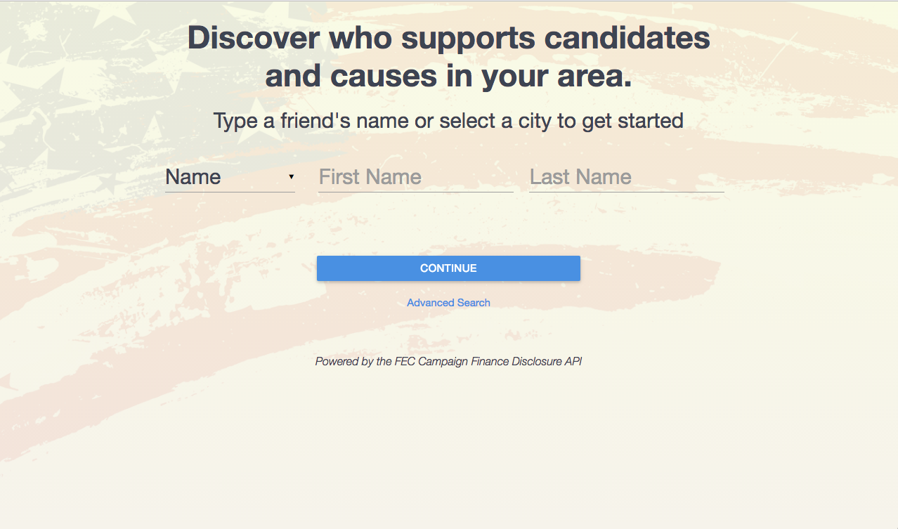
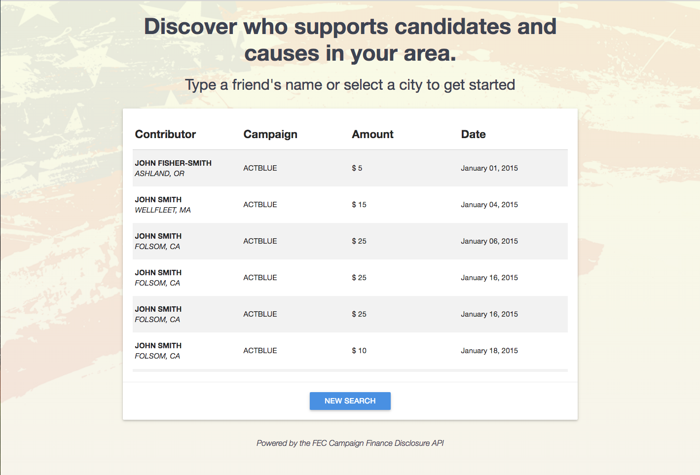

# [Campaign Donors](https://campaign-donors.herokuapp.com/)

Campaign Donors is a straight forward app that allows its users to discover who donates money to specific candidates and causes.

# Overview

Campaign Donors provides its users an interface to tap into data maintained by the Federal Election Commission. Users are able to use a dropdown navigation to search by either a person's name or by a person's hometown. An advanced search option is also available that can narrow the user's search to specific dates donations were made and amounts.

# Technical

The front-end utilizes jQuery and is styled with the Materialize CSS framework. The backe-end is built on NodeJS using a simple ExpressJS web server. Search queries result in data retrieved and reformatted from the Federal Election Commission's OpenFEC API, which is still in beta.

# UX

Initial view to user is search form for the name of a donor. User has option to change this form to search by state. User also has option to select 'Advanced Search' located under Continue button.

After selecting the search option, entering search values, and clicking continue button, the results will be displayed to the user. At the bottom of the results is a button that will allow the user to perform a new search.

# Development Roadmap

Future enhancements:

* continue improving UI

* provide more search features
    * search by committee name
    * search by candidate name
    * search by congressional district

* include map feature
